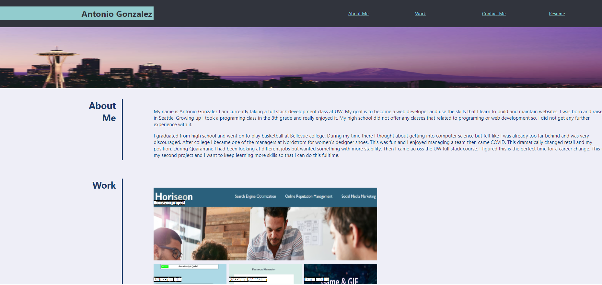

# My portfolio

This portfolio is a way to find out a little about where im from and how I got started in programing. There are links to my resume, linkedin profile and other projects that I have been working on. This will be updated as I complete more and more projects. 

## Screenshot

## Click the link beolow for the deployed application!
[My Profile](https://goantoniouw.github.io/Portfolio/)
